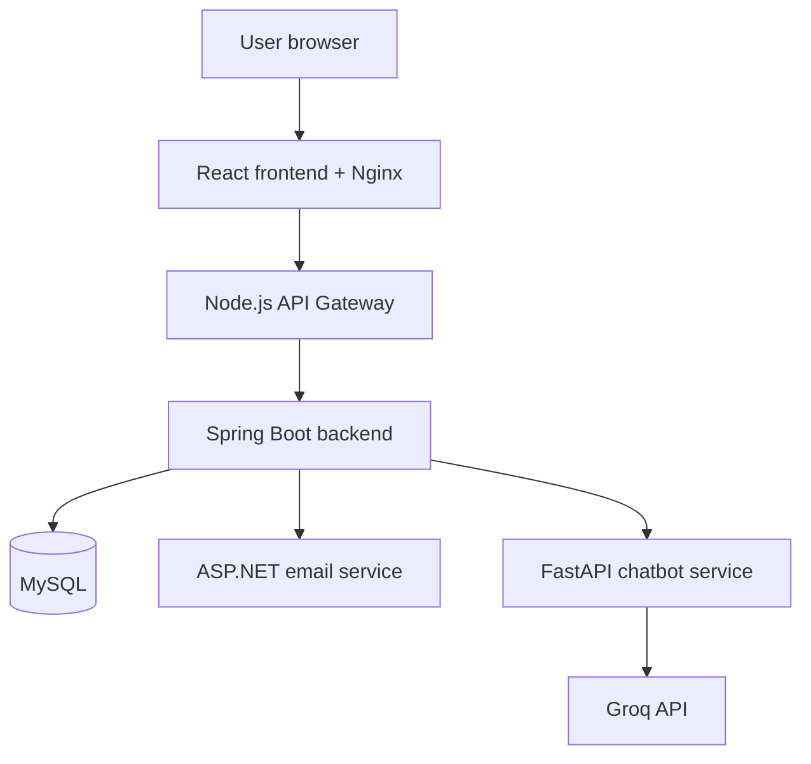

# SkillForge — Learning Management System


SkillForge is a full-stack, role-based Learning Management System designed for students, instructors and administrators. It supports the complete learning lifecycle: course creation and approval, enrollment and payment, lesson progress, quizzes, assignments, discussions, certificates, notifications, email delivery and a role-aware AI chatbot.

The application uses a microservices-oriented architecture with a React frontend, Node.js API Gateway, Spring Boot core backend, ASP.NET Core email service, FastAPI chatbot service and MySQL database. Every service can be started together using Docker Compose.

## Table of contents

- [Features](#features)
- [Architecture](#architecture)
- [Technology stack](#technology-stack)
- [Project structure](#project-structure)
- [Quick start with Docker](#quick-start-with-docker)
- [Application URLs](#application-urls)
- [Demo accounts](#demo-accounts)
- [Manual development setup](#manual-development-setup)
- [Environment configuration](#environment-configuration)
- [API documentation](#api-documentation)
- [Suggested testing flow](#suggested-testing-flow)
- [Useful Docker commands](#useful-docker-commands)
- [Security notes](#security-notes)
- [Git workflow](#git-workflow)

## Features

### Authentication and security

- User registration and login
- JWT-based stateless authentication
- Role-Based Access Control for `STUDENT`, `INSTRUCTOR` and `ADMIN`
- BCrypt password hashing
- Forgot-password and reset-password workflow
- Protected frontend routes and method-level backend authorization
- Profile management and password change
- Centralized exception handling

### Student module

- Browse approved courses by category and level
- Add or remove courses from the wishlist
- Purchase courses using simulated checkout or Razorpay
- View enrolled courses and lesson content
- Track lesson and course progress
- Attempt quizzes with marks, passing status and attempt limits
- Download assignments and upload submissions
- View assignment marks and instructor feedback
- Create course discussions and reply to existing discussions
- Generate, view and download course certificates
- Receive in-app notifications

### Instructor module

- Create, update and delete courses
- Organize courses into modules and lessons
- Add text content and video URLs to lessons
- Submit courses for admin approval
- Create and publish quizzes
- Create, publish, close and delete assignments
- Review student submissions and provide marks and feedback
- Participate in and manage course discussions
- Receive assignment and course notifications

### Admin module

- View platform dashboard statistics
- Approve or reject instructor accounts
- Activate, deactivate or remove users
- Approve or reject submitted courses
- Create, update and delete categories
- View platform payment records
- Review submitted contact messages

### Additional capabilities

- Role-aware AI chatbot backed by Groq
- Public chatbot responses for visitors and scoped data for authenticated roles
- ASP.NET Core email notification microservice
- In-app notification centre with unread counts
- Certificate PDF generation and QR-based verification
- Assignment and submission file storage
- Swagger/OpenAPI documentation
- Health checks for every service
- Dockerized local deployment with persistent MySQL and upload volumes

## Architecture



The browser sends `/api` requests through Nginx to the API Gateway. The gateway forwards the original request, authorization header and multipart body to the Spring Boot backend. Spring Boot performs authentication, authorization, validation and database operations, then calls the email or chatbot service when required.

## Technology stack

| Layer | Technologies |
|---|---|
| Frontend | React 19, Vite 8, React Router, Axios, Bootstrap 5, Bootstrap Icons |
| API Gateway | Node.js 22, Express 5, Axios, Helmet, CORS |
| Core backend | Java 17, Spring Boot 3.5.5, Spring Security, Spring Data JPA, Hibernate, Maven |
| Database | MySQL 8.4 |
| Authentication | JWT, Spring Security, BCrypt, RBAC |
| Email service | ASP.NET Core 8, MailKit, SMTP |
| Chatbot service | Python 3.12, FastAPI, Groq SDK, Pydantic |
| Payments | Razorpay Java SDK with a simulated checkout fallback |
| Certificates | Apache PDFBox and ZXing |
| API documentation | Springdoc OpenAPI and FastAPI Swagger |
| Deployment | Docker, Docker Compose and Nginx |

## Project structure

- `frontend/` — React user interface and Nginx configuration
- `api-gateway/` — centralized Express gateway for `/api` requests
- `backend/` — Spring Boot business logic, security, REST APIs and persistence
- `email-service/` — ASP.NET Core SMTP email microservice
- `chatbot-service/` — FastAPI service that communicates with Groq
- `compose.yml` — complete multi-container definition
- `.env.example` — environment-variable template
- `DOCKER_GUIDE.md` — extended Docker and troubleshooting guide

The Spring Boot backend follows a layered structure:

- `controller/` — REST endpoints
- `service/` — business rules and application workflows
- `repository/` — JPA data access
- `entity/` — database models
- `dto/` — request and response objects
- `security/` — JWT authentication and user-details integration
- `config/` — security, OpenAPI and seed-data configuration
- `exception/` — centralized error handling
- `client/` — email and chatbot service clients

## Quick start with Docker

Docker Compose is the recommended way to run the complete application.

### Prerequisites

- Git
- Docker Desktop with Docker Compose
- At least 6 GB of free memory available to Docker during the first build

### 1. Clone the repository

```bash
git clone <your-repository-url>
cd SkillForge
```

### 2. Create the environment file

Windows Command Prompt:

```bat
copy .env.example .env
```

Linux, macOS or Git Bash:

```bash
cp .env.example .env
```

Open `.env` and replace every `replace-*` value. Also add these two variables because the current Compose file uses them for image names:

```dotenv
DOCKERHUB_USERNAME=local
IMAGE_TAG=v1
```

Use your actual Docker Hub username instead of `local` if you plan to push the images.

At minimum, configure:

```dotenv
MYSQL_PASSWORD=choose-a-strong-application-password
MYSQL_ROOT_PASSWORD=choose-a-different-root-password
JWT_SECRET=use-a-random-secret-of-at-least-32-characters
ADMIN_PASSWORD=choose-a-strong-admin-password
EMAIL_SERVICE_INTERNAL_API_KEY=use-a-long-random-email-service-key
CHATBOT_INTERNAL_API_KEY=use-a-different-long-random-chatbot-key
```

Do not commit `.env`.

### 3. Configure optional integrations

The first start works without real email delivery or a Groq key:

```dotenv
EMAIL_ENABLE_DELIVERY=false
GROQ_API_KEY=
RAZORPAY_KEY_ID=
RAZORPAY_KEY_SECRET=
```

- With email delivery disabled, the email service runs in simulation mode.
- With an empty Groq key, the chatbot intentionally runs in demo mode.
- Razorpay values are needed only when testing real Razorpay payments.

For Gmail delivery, use a Google App Password rather than the normal account password:

```dotenv
EMAIL_ENABLE_DELIVERY=true
SMTP_HOST=smtp.gmail.com
SMTP_PORT=587
SMTP_ENABLE_SSL=false
SMTP_USERNAME=youraccount@gmail.com
SMTP_PASSWORD=your-google-app-password
SMTP_FROM_EMAIL=youraccount@gmail.com
SMTP_FROM_NAME=SkillForge
```

### 4. Validate and start the stack

```bash
docker compose config --quiet
docker compose up -d --build
docker compose ps
```

The first build downloads Java, Node.js, .NET, Python, Nginx and MySQL images, so it can take several minutes.

### 5. Verify service health

```bash
curl http://localhost:8080/health
curl http://localhost:8081/actuator/health
curl http://localhost:8082/api/email/health
curl http://localhost:8000/api/chatbot/health
```

On Windows Command Prompt, use `curl.exe` instead of `curl` if necessary.

## Application URLs

| Service | Address |
|---|---|
| SkillForge application | `http://localhost:5173` |
| Public API Gateway | `http://localhost:8080/api` |
| API Gateway health | `http://localhost:8080/health` |
| Spring Boot health | `http://localhost:8081/actuator/health` |
| Spring Boot Swagger | `http://localhost:8081/swagger-ui.html` |
| FastAPI chatbot Swagger | `http://localhost:8000/docs` |
| Chatbot health | `http://localhost:8000/api/chatbot/health` |
| Email service health | `http://localhost:8082/api/email/health` |
| MySQL | `localhost:3307` |

Only the frontend is intended as the normal browser entry point. The other host ports are exposed on `127.0.0.1` for local development and diagnostics.

## Demo accounts

When `SEED_DEMO_DATA=true`, the backend creates sample data and these development accounts:

| Role | Email | Password |
|---|---|---|
| Admin | Value of `ADMIN_EMAIL` | Value of `ADMIN_PASSWORD` |
| Instructor | `instructor@skillforge.local` | `Instructor@123` |
| Student | `student@skillforge.local` | `Student@123` |

These credentials are for local development only. Disable demo seeding and create secure accounts before any public deployment:

```dotenv
SEED_DEMO_DATA=false
```

## Manual development setup

Use this approach when you want to debug services individually. Start them in this order: MySQL, email service, chatbot service, Spring Boot backend, API Gateway and frontend.

### Required local software

- Java 17
- MySQL 8
- Node.js 22 and npm
- Python 3.12
- .NET 8 SDK

### 1. Database

Create a MySQL database and application user:

```sql
CREATE DATABASE skillforge_db;
CREATE USER 'skillforge'@'localhost' IDENTIFIED BY 'your-password';
GRANT ALL PRIVILEGES ON skillforge_db.* TO 'skillforge'@'localhost';
FLUSH PRIVILEGES;
```

Set `SPRING_DATASOURCE_URL`, `SPRING_DATASOURCE_USERNAME` and `SPRING_DATASOURCE_PASSWORD` in your backend run configuration. Hibernate creates or updates the required tables when `SPRING_JPA_HIBERNATE_DDL_AUTO=update`.

### 2. Email service

For the first local run, configure an internal API key and disable real delivery. Then run:

```bash
cd email-service
dotnet restore
dotnet run --urls http://localhost:8082
```

Required configuration names are `InternalApiKey` and `Email__EnableDelivery`. When delivery is enabled, also configure the `Email__SmtpHost`, `Email__SmtpPort`, `Email__SmtpUsername`, `Email__SmtpPassword`, `Email__FromEmail` and `Email__FromName` environment variables.

### 3. Chatbot service

```bash
cd chatbot-service
cp .env.example .env
python -m venv .venv
```

Activate the virtual environment:

```bash
# Linux/macOS/Git Bash
source .venv/bin/activate

# Windows Command Prompt
.venv\Scripts\activate
```

Install dependencies and start FastAPI:

```bash
pip install -r requirements.txt
uvicorn app.main:app --host 0.0.0.0 --port 8000 --reload
```

Set the same `CHATBOT_INTERNAL_API_KEY` in Spring Boot and `INTERNAL_API_KEY` in the chatbot `.env` file.

### 4. Spring Boot backend

Before starting, configure the database, JWT secret, frontend URL, admin credentials and matching internal service keys as environment variables.

Linux, macOS or Git Bash:

```bash
cd backend
./mvnw spring-boot:run
```

Windows Command Prompt:

```bat
cd backend
mvnw.cmd spring-boot:run
```

The backend starts on `http://localhost:8081`.

### 5. API Gateway

```bash
cd api-gateway
cp .env.example .env
npm ci
npm run dev
```

The gateway starts on `http://localhost:8080` and forwards `/api` requests to the Spring Boot backend.

### 6. React frontend

```bash
cd frontend
cp .env.example .env
npm ci
npm run dev
```

The frontend starts on `http://localhost:5173` and sends API requests to `http://localhost:8080/api`.

On Windows Command Prompt, replace each `cp .env.example .env` command with `copy .env.example .env`.

## Environment configuration

| Variable | Purpose | Required |
|---|---|---|
| `MYSQL_DATABASE` | MySQL database name | Yes |
| `MYSQL_USER` | MySQL application username | Yes |
| `MYSQL_PASSWORD` | MySQL application password | Yes |
| `MYSQL_ROOT_PASSWORD` | MySQL administrator password | Yes for Docker |
| `JWT_SECRET` | JWT signing secret of at least 32 characters | Yes |
| `JWT_EXPIRATION` | Token lifetime in milliseconds | No |
| `ADMIN_EMAIL` | Initial admin email | Yes |
| `ADMIN_PASSWORD` | Initial admin password | Yes |
| `EMAIL_SERVICE_INTERNAL_API_KEY` | Spring-to-email authentication key | Yes |
| `CHATBOT_INTERNAL_API_KEY` | Spring-to-chatbot authentication key | Yes |
| `EMAIL_ENABLE_DELIVERY` | Enables real SMTP delivery | No |
| `SMTP_USERNAME` | SMTP/Gmail account | When email is enabled |
| `SMTP_PASSWORD` | SMTP or Gmail App Password | When email is enabled |
| `GROQ_API_KEY` | Enables live Groq responses | No |
| `GROQ_MODEL` | Groq model identifier | No |
| `RAZORPAY_KEY_ID` | Razorpay public key | For real Razorpay payments |
| `RAZORPAY_KEY_SECRET` | Razorpay secret | For real Razorpay payments |
| `FRONTEND_URL` | Allowed CORS origin | Yes |
| `SEED_DEMO_DATA` | Creates development users and sample course | No |
| `NOTIFICATIONS_ENABLED` | Enables in-app notification creation | No |
| `UPSTREAM_TIMEOUT_MS` | Normal gateway timeout | No |
| `CHATBOT_TIMEOUT_MS` | Longer timeout for AI requests | No |

## API documentation

The complete Spring Boot API is documented at:

```text
http://localhost:8081/swagger-ui.html
```

Major endpoint groups include:

| Module | Base route |
|---|---|
| Authentication | `/api/auth` |
| Courses | `/api/courses` |
| Instructor content | `/api/instructor` |
| Admin users and courses | `/api/admin` |
| Categories | `/api/categories` |
| Enrollments | `/api/enrollments` |
| Learning progress | `/api/learning` |
| Payments | `/api/payments` |
| Quizzes | `/api/quizzes` |
| Assignments | `/api/instructor/assignments`, `/api/student/assignments` |
| Discussions | `/api/discussions` |
| Certificates | `/api/certificates` |
| Notifications | `/api/notifications` |
| Wishlist | `/api/wishlist` |
| Profile | `/api/profile` |
| Chatbot | `/api/chatbot` |

To test protected endpoints in Swagger:

1. Call `POST /api/auth/login`.
2. Copy the JWT token from the response.
3. Click **Authorize** in Swagger.
4. Paste the token and authorize. Swagger supplies the Bearer authentication scheme.

## Suggested testing flow

1. Start all services and verify every health endpoint.
2. Sign in as admin and verify user, category and course-management screens.
3. Sign in as instructor, create a course, add modules and lessons, create a quiz and submit the course for approval.
4. Approve the course from the admin account.
5. Sign in as student, add the course to the wishlist and complete checkout.
6. Open the enrolled course, mark lessons complete and attempt the quiz.
7. Publish an assignment as instructor, submit it as student, then evaluate it as instructor.
8. Test course discussions and in-app notifications.
9. Complete the course, generate a certificate, download it and verify its serial number.
10. Send a chatbot question and confirm the response is scoped to the current role.

## Useful Docker commands

View container status:

```bash
docker compose ps
```

Follow all logs:

```bash
docker compose logs -f --tail 200
```

Follow one service:

```bash
docker compose logs -f backend
docker compose logs -f chatbot-service
docker compose logs -f email-service
```

Rebuild one changed service:

```bash
docker compose up -d --build --force-recreate backend
```

Stop the stack while preserving data:

```bash
docker compose down
```

Restart the stack:

```bash
docker compose up -d
```

Delete containers and all named volumes, including the database and uploaded files:

```bash
docker compose down -v
```

> Warning: `docker compose down -v` permanently removes local SkillForge database data and uploaded assignment files.

## Security notes

- Never commit `.env`, API keys, SMTP credentials or database passwords.
- Replace all development credentials before deployment.
- Use different values for the email and chatbot internal API keys.
- Use a strong random JWT secret of at least 32 characters.
- Keep Razorpay secret keys on the backend only.
- Use a Google App Password for Gmail SMTP; never use the normal Google password.
- Keep `SEED_DEMO_DATA=false` outside local development.
- Do not commit files from `backend/uploads/`.
- Rotate any secret immediately if it is accidentally committed or shared.

## Git workflow

Create a feature branch for each module:

```bash
git checkout -b feature/module-name
```

Review changes before committing:

```bash
git status
git diff --cached
```

Example commit for the complete application:

```bash
git commit -m "feat: add complete SkillForge backend and frontend application"
```

Push the branch:

```bash
git push -u origin feature/module-name
```

---

SkillForge was developed as a practical full-stack learning platform demonstrating secure REST API development, role-based access control, microservice communication, payment integration, AI integration and containerized deployment.
